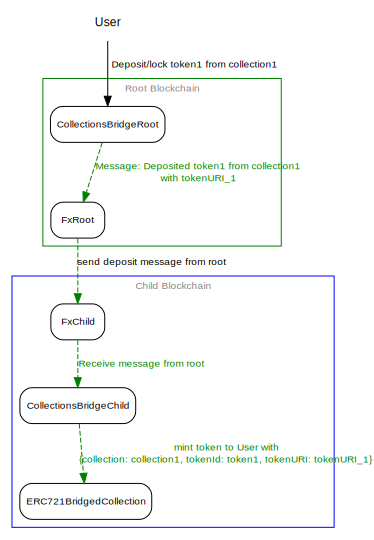
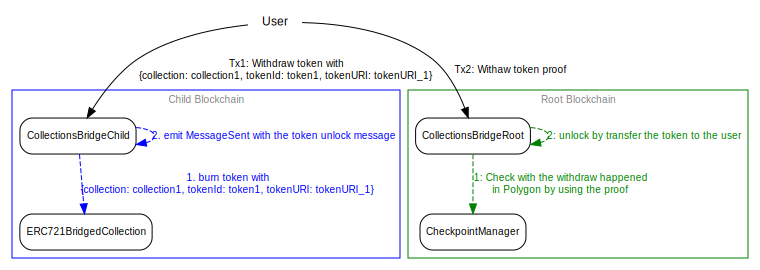

# Collections Bridge

Legacy Decentraland Collections (v1) created in Ethereum mainnet can be bridged to Polygon by using the `CollectionsBridgeRoot` deployed in Ethereum. The NFT will be received by the `CollectionsBridgeChild` deployed in the Polygon network. This NFTs are going to be mapped in a `ERC721BridgedCollection` contract will be deployed in Polygon. Each NFT will keep its collection address, token id, and tokenURI as explaining [here](https://github.com/decentraland/adr/blob/main/docs/ADR-4-collections-architecture-in-L1-L2.md#alternative-2-minimalist-collection-replication). The `ERC721BridgedCollection` is a simple compliant ERC721 smart contract with `batchTransferFrom` methods.

The same is going to happen with the Decentraland collections (v2) deployed in Polygon. The same mechanism as for the collections v1 are going to be used with the obvious difference of where the contracts are going to be deployed. In Polygon is going to be deployed a `CollectionsBridgeRoot` where in Ethereum, `CollectionsBridgeChild` and `ERC721BridgedCollection`.

The other difference between the bridges is the validator that is using each root bridge. A Bridge Validator is a smart contract used by the `CollectionsBridgeRoot` to check whether a collection can be bridged or not. For the collections v1, `ERC721CollectionV1Validator` will be used. Decentraland has a fixed amount of collections deployed in Ethereum so the set up is something easy. For the collections v2, `ERC721CollectionV2Validator, will receive a list of collection's factories. Those factories must implement `isCollectionFromFactory`.

## Smart Contracts Notes

`CollectionsBridgeRoot`: Smart contract used to lock/unlock Decentraland Collections (v1 & v2) NFTs. This contract can be deployed either in Ethereum or Polygon.

`FxRoot`: Smart contract controlled by the Polygon project deployed in Ethereum. This contract is used to send messages from the `CollectionsBridgeRoot` to the `CollectionsBridgeChild`.

`fxRootTunnel`: Reference to the `CollectionsBridgeRoot` in `CollectionsBridgeChild`.

`CheckpointManager`: Smart contract controlled by the Polygon project deployed in Ethereum. This contract is used to check if certain messages/transactions had happened in Polygon. You can see a checkpoint as a bunch of state changes happened in Polygon. e.g: A ERC20 withdraw, ERC721 withdraw, etc. Polygon works with checkpoints to communicate Polygon -> Ethereum and state syncs to communicate Ethereum -> Polygon. You can read more [here](https://docs.matic.network/docs/contribute/heimdall/modules/checkpoint)

`CollectionsBridgeChild`: Smart contract used to mint/burn `ERC721BridgedCollection` NFTs. This contract can be deloyed either in Ethereum or Polygon.

`FxChild`: Smart contract controlled by the Polygon project deployed in Polygon. This contract will call the `CollectionsBridgeChild` to process the messages emitted by the `CollectionsBridgeRoot`. To send a message to the `CollectionsBridgeRoot`, just an event needs to be emitted (`MessageSent(string _message`).

`fxChildTunnel`: Reference to the `CollectionsBridgeChild` in `CollectionsBridgeRoot`

# Deposit

# Withdraw

