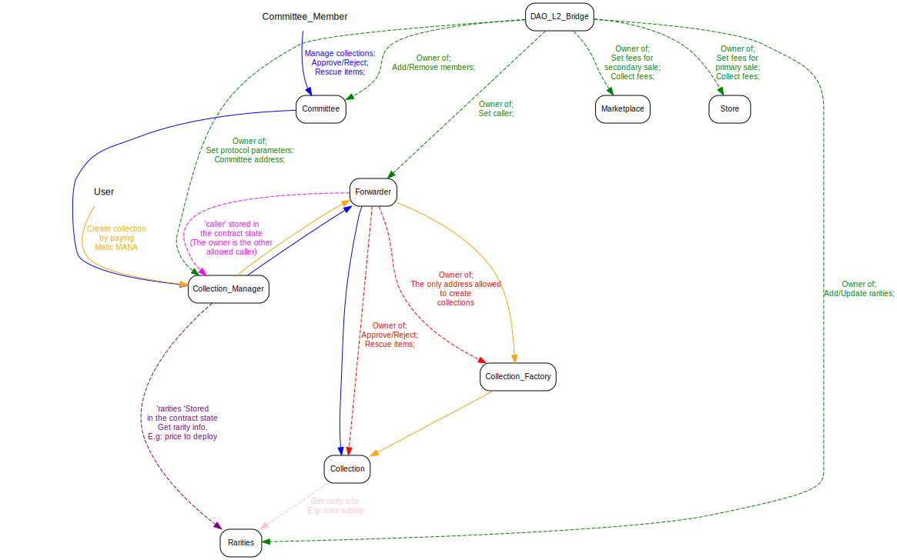

<pre>
  Title: Collections V2 approval flow
  Author: Ignacio Mazzara <nacho@decentraland.org>
  Type: informational
  Created: 2020-08-28
</pre>

# Collection V2 contract

## Table of Contents

- [Introduction](#introduction)
- [Abstract](#abstract)
- [Design](#design)
- [Actors](#actors)

## Introduction

Every item as wearable, emotes, 3d object, etc in Decentraland's world is represented by a non-fungible token ERC #721 that is indivisible and unique. Those items together defines a collection which works as a registry powered by a smart contract where it is defined all the information. A collection can be built by anyone but approved by a governance system (committee).

## Abstract

A way to moderate the content of the Decentraland collections is needed to prevent spam, abuse, clone and copyright. The Decentraland's collections will be created in a L2 governed any kind of governance in L1. E.g: DAO. The collection deployment will has a cost in MANA based on the items amount and its rarities. Also, each collection will be created as rejected awaiting for the approval of the members of the committee.

## Design

### Actors

**DAO_L2_Bridge**: Contract which receives messages from the any kind of governance in L1 (DAO). It sets the protocol parameters for every smart contract living in L2. Also, this actor will receive funds for every collection deployment.

**Committee**: collections' committee. The DAO will add/remove members, and members can manage collections through it. The committee members can approve/reject a collection and also [rescue collection's items](./Collections_V2.md#owner).

**Collection_Manager**: The collections' manager contract. This contract is responsible for creating collections and also allowing the Committee to manage them. Every user will be able to deploy collections by paying X MANA. The amount of MANA to pay will be collected by the DAO bridge to be sent later to the governance fund manager entity in L1. The collection manager has some variables that can be updated by the owner: _mana contract_, _committee contract_, _fee collector_ and _rarities contract_ . In first place, the owner will be the DAO bridge. Once the collection is deployed:

- The committee smart contract can approve/reject collections, set collections as editable, and rescue items.
- The collection's creator can add items to the collection by paying X MANA if the collection is not completed. **EVERY COLLECTION IS GOING TO BE COMPLETED AUTOMATICALLY WHEN IT IS DEPLOYED. THEREFORE THIS ONLY BE ADDED IN CASE OF NEEDED**

- **Forwarder**: The forwarder is a contract which forwards calls to target contracts. The forwarder is the owner of the collection factory and therefore each collection. You can see it just as a _tube_. Being the owner of the factory means that it is the only address allowed to create collections by using the factory. Forcing this way, users must use the manager to create every collection. The owner of the forwarder (DAO bridge) will be able to update the collection address factory in case we need to change it. The forwarder can send any transaction to any target and its owner can be changed.

**Collection_Factory**: The collectin factory is the contract used to create collections. We are using the [minimal proxy pattern](https://eips.ethereum.org/EIPS/eip-1167) to reduce costs for deploying a collection. It is using `CREATE2` to deploy collection just to keep a determinstic way to know the collection address in advance for development purpose. If later we need to change the collection contract. A new factory should be deployed along with the new contract implementation contract. The owner of the collection factory is the forwarder.

**Collection**: collection contract implementation. The owner of each collection will be the forwarder.

**Rarities**: Contract with all the rarities info: name, max supply, and price to deploy. Rarities can only be added, and only the price can be updated. The only entity allowed to do this is the the DAO bridge.
